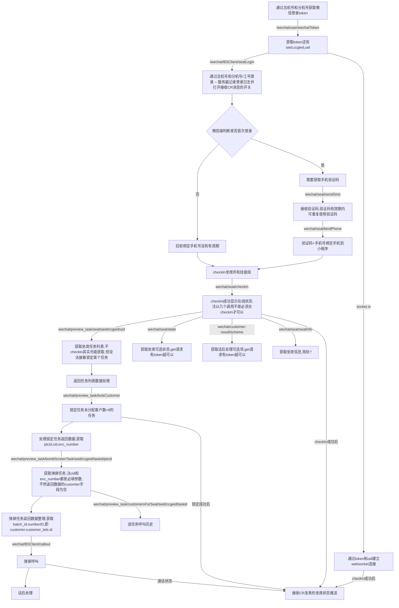
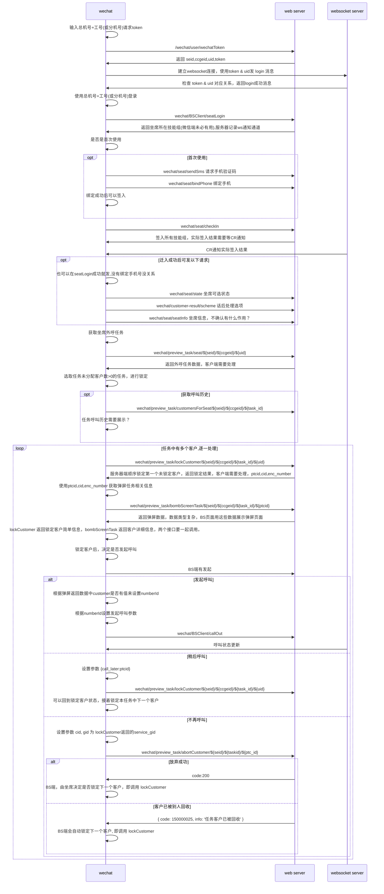

## 模拟微信小程序脚本说明

可实际执行脚本 `DEBUG="wechat:*" node token.js` 验证以下过程

### 主流程图

#### 呼叫任务流程

```  mermaid
 graph TD
   1[通过总机号和分机号获取微信登录token] -- /wechat/user/wechatToken -->1.1
   1.1[获取token还有seid,ccgied,uid] -- /wechat/BSClient/seatLogin -->2
   1.1 -- socket.io --> 21[通过token和uid建立websocket连接]
   2[通过总机号和分机号/工号登录 -- 服务器记录登录日志并打开接收CR消息的开关] -->a
   a{微信端判断是否首次登录} -->|是|b[需要获取手机验证码]
   b -- wechat/seat/sendSms --> b1[接收验证码,验证码有效期内可重复使用验证码]
   b1 -- wechat/seat/bindPhone --> c[验证码+手机号绑定手机到小程序]
   a -->|否|d[目前绑定手机号没有有效期]
   c -->3[checkIn坐席所有技能组]
   d -->3
   3 -- wechat/seat/checkIn --> 4[checkIn成功显示在线状态,注以几个调用不是必须在checkIn才可以]
   21 -- checkIn成功后 --> 22[接收CR发来的坐席状态推送]
   4-->|checkIn成功后|22
   4 -- wechat/preview_task/seat/seid/ccgeid/uid --> 4.1
   4.1[获取坐席任务列表,不checkin其实也能获取,但没法接着锁定某个任务] -->5[返回任务列表数据处理]
   4 -- wechat/seat/state --> 4.2[获取坐席可选状态,get请求有token就可以]
   4 -- wechat/customer-result/scheme --> 4.3[获取话后处理可选项,get请求有token就可以]
   4 -- wechat/seat/seatInfo --> 4.4[获取坐席信息,用处?]
   5 -- wechat/preview_task/lockCustomer -->5.1[锁定任务未分配客户数>0的任务]
   5.1 --> 5.2[处理锁定任务返回数据,获取ptcid,cid,enc_number]
   5.1 -- 锁定成功后 --> 22
   5.2 -- wechat/preview_task/bombScreenTask/seid/ccgeid/taskid/ptcid -->6
   6[获取弹屏任务,注cid和enc_number都是必填参数,不然返回数据的cusomter字段为空] --> 6.1
   6 -- wechat/preview_task/customersForSeat/seid/ccgeid/taskid -->6.2[该任务呼叫历史]
   6.1[弹屏任务返回数据整理,获取batch_id,numberID,即 customer.customer_tels.id] 
   6.1 -- wechat/BSClient/callout -->7
   7[弹屏呼叫] --> 8[话后处理]
   7 -- 通话状态 -->22
```

### 主时序交互图

#### 呼叫任务流程

```mermaid
sequenceDiagram
    participant w as wechat
    participant s as web server
    participant ws as websocket server
    w->>w:输入总机号+工号(或分机号)请求token
    w->>s: /wechat/user/wechatToken
    s->>w: 返回 seid,ccgeid,uid,token
    w->>ws: 建立websocket连接，使用token & uid发 login 消息
    ws->>w: 检查 token & uid 对应关系，返回login成功消息
    w->>w:使用总机号+工号(或分机号)登录
    w->>s: wechat/BSClient/seatLogin
    s->>w:返回坐席所在技能组(微信端未必有用),服务器记录ws通知通道
    w->>w:是否是首次使用
    opt 首次使用
    	w->>s: wechat/seat/sendSms 请求手机验证码
      w->>s: wechat/seat/bindPhone 绑定手机
      w->>w: 绑定成功后可以签入
    end
    w->>s:wechat/seat/checkIn
    s->>w:签入所有技能组，实际签入结果需要等CR通知
    ws->>w:CR通知实际签入结果
    opt 迁入成功后可发以下请求
     w->>w:也可以在seatLogin成功就发,没有绑定手机号没关系
     w->>s: wechat/seat/state 坐席可选状态
     w->>s: wechat/customer-result/scheme 话后处理选项
     w->>s: wechat/seat/seatInfo 坐席信息，不确认有什么作用？
    end
    w->>w:获取坐席外呼任务
    w->>s:wechat/preview_task/seat/${seid}/${ccgeid}/${uid}
    s->>w:返回外呼任务数据，客户端需要处理
    w->>w:选取任务未分配客户数>0的任务，进行锁定
    opt 获取呼叫历史
     w->>s: wechat/preview_task/customersForSeat/${seid}/${ccgeid}/${task_id}
     w->>w:任务呼叫历史需要展示？
    end
    loop 任务中有多个客户,逐一处理
    w->>s:wechat/preview_task/lockCustomer/${seid}/${ccgeid}/${task_id}/${uid}
    s->>w:服务器端顺序锁定第一个未锁定客户，返回锁定结果，客户端需要处理，ptcid,cid,enc_number
    w->>w:使用ptcid,cid,enc_number 获取弹屏任务相关信息
    w->>s:wechat/preview_task/bombScreenTask/${seid}/${ccgeid}/${task_id}/${ptcid}
    s->>w:返回弹屏数据，数据类型复杂，BS页面用这些数据展示弹屏页面
    w->>w:lockCustomer 返回锁定客户简单信息，bombScreenTask 返回客户详细信息，两个接口要一起调用。
    w->>w:锁定客户后，决定是否发起呼叫
    w->>s:BS端有发起
    alt 发起呼叫
      w->>w:根据弹屏返回数据中customer是否有值来设置numberId
      w->>w:根据numberId设置发起呼叫参数
      w->>s:wechat/BSClient/callOut
      ws->>w:呼叫状态更新
    else 稍后呼叫
      w->>w:设置参数 {call_later:ptcid}
      w->>s:wechat/preview_task/lockCustomer/${seid}/${ccgeid}/${task_id}/${uid}
      w->>w:可以回到锁定客户状态，接着锁定本任务中下一个客户
    else 不再呼叫
      w->>w:设置参数 cid, gid 为 lockCustomer返回的service_gid
      w->>s:wechat/preview_task/abortCustomer/${seid}/${taskid}/${ptc_id}
      alt 放弃成功
      s->>w:code:200
      w->>w: BS端，由坐席决定是否锁定下一个客户，即调用 lockCustomer
      else 客户已被别人回收
      s->>w:{ code: 150000025, info: '任务客户已被回收' }
      w->>w: BS端会自动锁定下一个客户, 即调用 lockCustomer
      end
    end
    end
```

